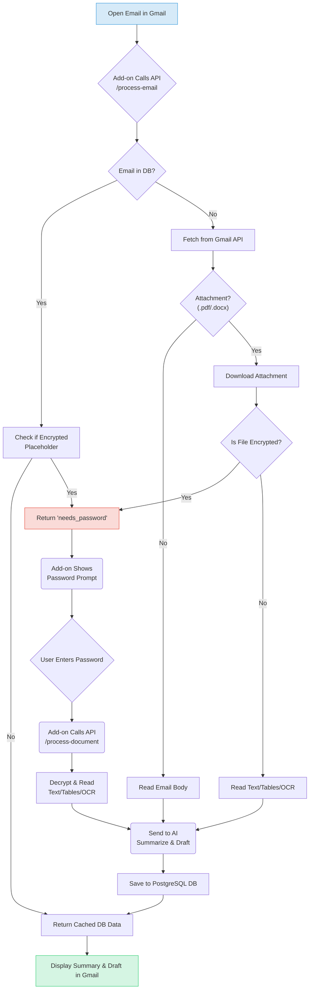

# 📧 SmartMail Agent: An AI-Powered Gmail Assistant

<p align="center">
  
  
  
  
  
</p>

---

<p align="center">
  
</p>

**SmartMail Agent** is a fully deployed, end-to-end AI assistant living inside **Gmail** — summarizing, analyzing, and replying to emails with human-like precision.  
It processes encrypted attachments, categorizes emails, and runs 24/7 in the cloud.

---

## 🌐 Live Demos

- 🧠 [Analytics Dashboard](#)  
  

- ⚙️ [API Docs (Swagger UI)](#)  
  

---

## 🚀 Core Features

| Feature | Description |
|----------|--------------|
| 🤖 **AI Summaries** | Generates concise summaries & draft replies via **LangChain + OpenAI (GPT)** |
| 📎 **Attachment Reader** | Reads text/tables from `.pdf` & `.docx`, even scanned images (OCR via Tesseract) |
| 🔐 **Encrypted File Support** | Detects & decrypts password-protected PDFs/DOCs (`pikepdf`, `msoffcrypto`) |
| 📨 **Primary Inbox Focus** | Ignores “Promotions” & “Social” tabs |
| 🧩 **Categorization** | Auto-labels emails (Work, Finance, etc.) and assigns priority |
| ☁️ **24/7 Cloud** | Containerized & deployed with **Docker + Render** |

---

## 🖥️ Interface

### 📬 Gmail Add-on
- “**Today’s Digest**” summary view  
- Auto AI summaries & editable draft replies  
- Password prompt for encrypted files  
- Human-in-the-loop “Send” button  

### 📊 Analytics Dashboard
- Built-in FastAPI dashboard  
- Live visualization of email categories (from PostgreSQL)


---

## 🧠 Application Logic Flowchart



## 🛠️ Tech Stack & Architecture

| Area | Technology | Purpose |
|------|-------------|----------|
| 🧩 **Backend** | Python 3.11, FastAPI | Asynchronous REST API |
| 🧠 **AI Layer** | LangChain, OpenAI (GPT) | Summarization, classification & reply generation |
| 🐳 **Deployment** | Docker, Render | Containerization & 24/7 hosting |
| 🗄️ **Database** | PostgreSQL, SQLAlchemy | Persistent storage & analytics |
| 💻 **Frontend** | Google Apps Script | Gmail Add-on (native sidebar UI) |
| 📄 **PDF Parsing** | pikepdf | Secure decryption & text extraction |
| 📝 **Word Parsing** | python-docx, msoffcrypto | DOCX reading & encryption handling |
| 📊 **Table Extraction** | camelot-py | Extract tables from PDFs |
| 🧾 **OCR** | pytesseract, pdf2image | Read scanned (image-based) PDFs |
| 🔑 **Auth** | Google OAuth 2.0 | Secure Gmail API access |

---


## 🏃‍♂️ Run Locally

### 1️⃣ Clone Repository

```bash
git clone https://github.com/[YOUR-USERNAME]/[YOUR-REPO-NAME].git
cd [YOUR-REPO-NAME]
```

2️⃣ Create Virtual Environment
```bash
python -m venv venv
source venv/bin/activate  # (or .\venv\Scripts\activate on Windows)
```

3️⃣ Install Dependencies
```bash
pip install -r requirements.txt
```

### 🧩 System Dependencies (for OCR & Table Extraction)

| 🖥️ **OS** | ⚙️ **Installation Command** |
|------------|------------------------------|
| 🪟 **Windows** | Install **Poppler** + **Tesseract OCR** (add both to your system PATH) |
| 🍎 **macOS** | `brew install poppler tesseract` |
| 🐧 **Linux** | `sudo apt-get install poppler-utils tesseract-ocr` |


Create a .env file in your project root:
```bash
OPENAI_API_KEY="sk-..."
USER_NAME="Your Name"
```

🔑 Authenticate Gmail API
```bash
python cli.py
```

🚀 Run the Server
```bash
uvicorn main:app --reload
```

Then open your browser at:
👉 http://127.0.0.1:8000/docs

<p align="center"> <b>💡 SmartMail Agent — AI at your Inbox!</b> </p>
